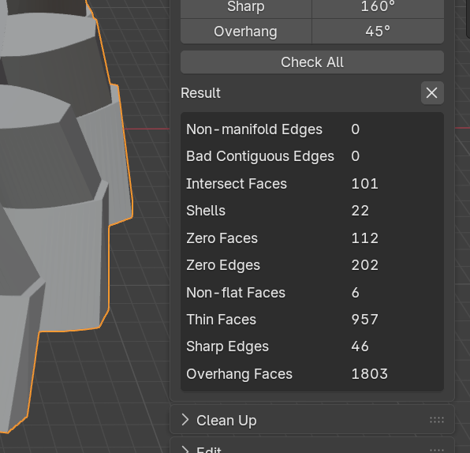
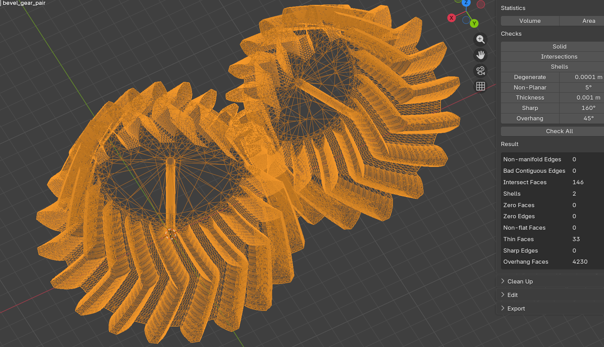
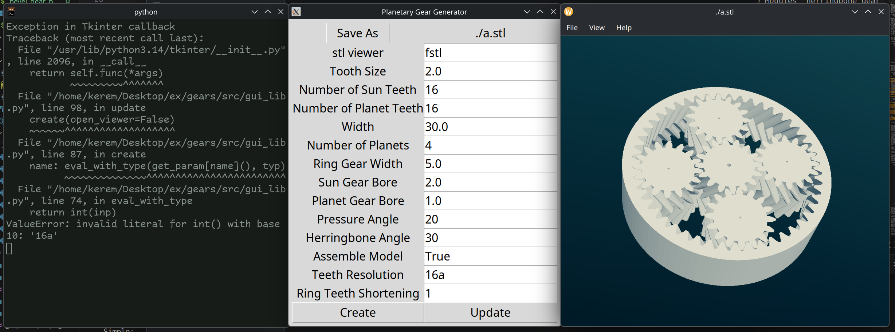

### Readme

This is an effort to port the original openscad library.

The main reason I started to do this is that the openscad stl creation
process is complicated and error-prone. Since it's a Constructive Solid
Geometry program (it does differences, unions, etc. of 3d volumes), it's
difficult for it to compile to stl, which is just a list of triangles in
3d space.

This program by comparison, calculates the correct positions of vertices
and saves them directly into stl files. It also does something similar
to Delauney refinement to simplify the faces with high numbers of vertices.

The examples below are created using the `make_comparison` script, and are
also in the `comparison` folder.

before:

after:

This should make it easier to work with the generated models in other software.
Also, this program is significantly faster. Generating the comparison
images took `0.8439 seconds` with this project and `228.2624 seconds`
with the original. Openscad (at least, by default) creates ASCII STL files,
which take more space (per facet) but are more human-readable than the
smaller binary STL files created by this library.

The easiest way to use this program is by clicking on the scripts under
`bin`. These just call `src/gui.py` with the corresponding argument. You
can also import `lib.py` (or `mesh.py` and `gears.py`) from python.

### Explanation of Some Parameters
Many of the parameters are self-explanatory or make an obvious impact when changed.

Here are a few that might not be:
- all angles in the gui and `lib.py` is in degrees; all angles in any other python files are in radians.
-  `stl_viewer`: `fstl` is a lightweight stl viewer available in Windows and Linux for free, and it's what's screenshotted above. I have not tested this with other viewers.
- `Width at Teeth`: Since the two gears might have different widths, the width is measured at the teeth, where they meet.
- `Pressure Angle`: You can look up pressure angle for gears to see pictures of what this is. 20 degrees is one standard.
- `* Resolution`: Determines model complexity. For example, teeth resolution is the number of points in the curved part of a gear tooth (minus one, if you include the endpoints of the latter).
- `addendum factor`: This is specified as 1 in DIN 867 and as 1.1 in DIN 58400. The original code uses `1` if `Tooth Size` is less than `1`, and `1.1` otherwise. However, bevel gears have variable tooth sizes, and you might want to keep this a constant across a project.
- `Create` vs `Update`: The only difference is that `Create` also opens the stl viewer.

### to do

nice to have:
* align gears exactly the way openscad aligns them so the comparison is easier?
    * This is much better than the earlier revision! The only possible remaining issues are:
        - What's going on with the bevel gear tooth tips?
        - pick better shortening factor for comparison
* gui for some other functions?
* port other gear designs?
