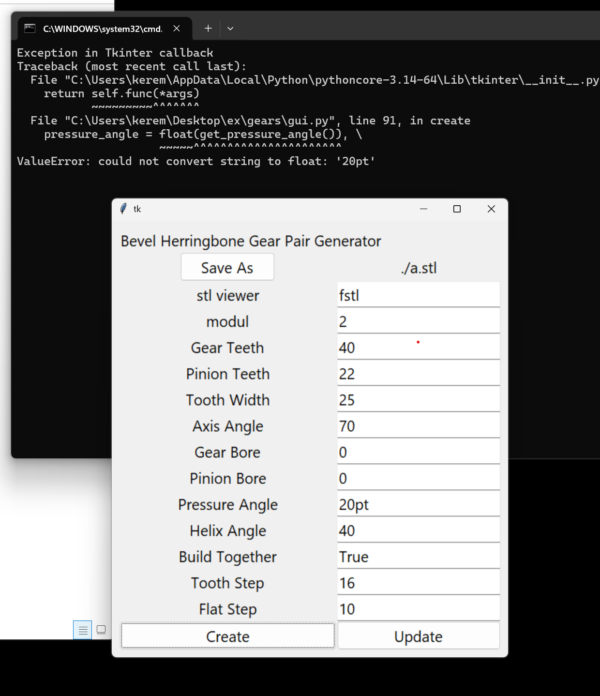

This is an effort to port the openscad code to a python script creating the stl
directly. This creates a nicer stl file. See the comparison folder.

The openscad version goes through several stages of turning the mathemetical
formulas into sets of rectangular blocks, trying to union and subtract them,
etc. This program, by comparison calculates vertexc placements and saves them
in an stl file.

So, the improvement is that there are fewer jagged corners, edges, gears sticking
together. It's easier to work with in 3d modeling software.

The easiest way to use this program is by clicking on `run_gui.bat`. This runs
the tkinter script `gui.py`, pictured below. Errors will show up on the terminal window.
`gears.py` creates lists of 3d points and provides a nicer api than `gears_internal.py`.
`make_stl.py` puts those lists in an stl file. `main.py` has the code to generate the examples.

to do:

* go over examples
* planetary gear
    - there's a bug to fix in original!
    - gui

nice to have:
* better comparison with openscad versions

* I adapted bevel gears which use spherical coordinates to make flat gears (called spur
    gears in original), but the library contains math to do this using polar instead of spherical coordinates. So, I should probably port that code instead.
* tkinter gui for the other three functions?
* port other gear designs?
* especially ring gear!
